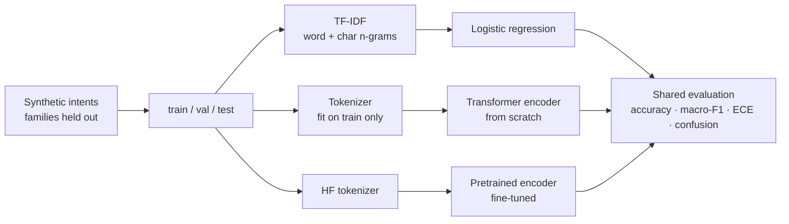

# Intent Classification Lab

[](https://github.com/saianthireddy/intent-classification-lab/actions/workflows/ci.yml) [](https://github.com/saianthireddy/intent-classification-lab) [](LICENSE)

**Three approaches to the same intent-classification task, on identical splits, with identical metrics** — a TF-IDF baseline, a Transformer encoder written from scratch in PyTorch, and a fine-tuned pretrained encoder.

The point isn't the winner. It's that the comparison is set up so a loss is visible, and then reported honestly when it happens.

## The headline result

**The linear baseline beats the from-scratch Transformer**, and is three times better calibrated.

| Model | Params | Accuracy | Macro-F1 | ECE | Train time |
|---|---:|---:|---:|---:|---:|
| TF-IDF + logistic regression | ~30k features | 0.500 | **0.463** | **0.137** | 0.1s |
| Transformer from scratch | 72,966 | 0.490 | 0.436 | 0.406 | 4.6s (CPU) |
| Fine-tuned `bert-tiny` | 4.4M | *not run — see below* | | | |

Reproduce with `python scripts/run_comparison.py`. CI runs that script on every push, so if these numbers stop being reproducible the build fails.

That result is the expected one, and the interesting part is *why*:

- **34% of test tokens are words the training split never contained.** A randomly-initialised word embedding has nothing useful to say about an unseen word. TF-IDF with character n-grams degrades gracefully instead — an unknown word still shares substrings with known ones.
- **176 training examples is not enough to learn attention from scratch.** 73k parameters over 176 examples is a losing ratio, and no amount of architecture fixes it.
- **The Transformer is badly calibrated** (ECE 0.406 vs 0.137). It is confidently wrong, which for a support router is worse than being uncertain — you cannot set an "escalate below threshold X" policy on top of it.

The conclusion is the argument for transfer learning: at this data scale the win comes from **pretrained representations**, not from architecture. Which is what the third row is for.

## Why the third row is empty

The fine-tuning path is fully implemented in [`src/intent_lab/finetune.py`](src/intent_lab/finetune.py) and tested, but **I have not run it, so I am not publishing a number for it.**

The environment this was written in cannot reach the Hugging Face hub, so there are no pretrained weights to load. Filling in a plausible-looking score would be worse than leaving the row blank.

What *is* tested offline, through an injected fake backend: label ordering, encoding, split integrity, the metric function, overflow-safe softmax, and the guard that fires when `transformers` isn't installed. Everything except the network call.

To produce the real number:

```bash
pip install -r requirements-finetune.txt
python scripts/finetune_bert.py --model prajjwal1/bert-tiny
```

Then paste accuracy / macro-F1 / ECE into the table above.

## The dataset is built to be beatable, but not trivially

Generated data usually flatters models, because it's tempting to give each class its own keywords — which produces 1.00 accuracy and tells you nothing. Three deliberate choices stop that:

- **Shared vocabulary.** `reset`, `account`, `charge` and `order` each appear under more than one intent, so no class is separable on a single keyword. 32 tokens are ambiguous across intents.
- **Confusable pairs.** `billing_question` vs `refund_request`, and `password_reset` vs `account_access`, are close in surface form on purpose. Most residual error lives there — the confusion matrix shows `refund_request → order_status` accounting for all 16 refund errors.
- **Template families held out by split.** Phrasings are partitioned *before* rendering, so a phrasing seen in training never recurs in test. Splitting after rendering leaks: the same sentence appears in both with a different prefix, and the score is inflated.

`test_template_families_are_held_out_not_just_renderings` enforces the third one, and `test_intents_share_vocabulary_so_the_task_is_not_trivial` the first.

## Architecture



Every model reports through the same `evaluate()`, so the rows in that table are directly comparable.

## What's written by hand

`nn.TransformerEncoder` would be three lines and the right call in production. It's the wrong call here, because the mechanics are the point:

- **Scaled dot-product attention** with a key-padding mask — masked scores go to `-inf` *before* the softmax, so they contribute exactly zero rather than being zeroed afterwards and leaving the remaining weights unnormalised.
- **Multi-head projection and recombination** from a single fused QKV linear.
- **Pre-norm residual blocks** (`x + attn(norm(x))`) rather than post-norm, which needs learning-rate warmup to train stably. Pre-norm doesn't, which is what lets this train on a laptop CPU in five seconds.
- **Sinusoidal positional encoding.**
- **Masked mean pooling** rather than a `[CLS]` token — with ~200 examples there isn't enough signal to teach a token to summarise a sequence.

### Two correctness properties worth calling out

**Padding cannot leak into real tokens.** `test_pad_contents_cannot_influence_real_positions` replaces the pad rows with values 500× larger and asserts real-position outputs are *bit-identical*. Not "close" — equal.

**Sequence length invariance is *not* exact, and the test says so.** The same content with more padding differs by ~1e-3 in float32, because changing the padded length changes the matmul reduction length, and float addition isn't associative. What the test asserts instead is that the discrepancy is **precision-bound**: it shrinks by more than six orders of magnitude going from float32 to float64. Leakage wouldn't do that; rounding does.

That test earned its keep. An earlier version asserted float64 was bit-exact — true on the aarch64 machine it was written on, false on the x86_64 CI runner, which uses a different BLAS and accumulates in a different order. CI caught a claim that was architecture-specific dressed up as a universal one. The fix was to weaken the assertion to what's actually true everywhere, not to loosen the tolerance until it went quiet.

## A bug this test suite found

`test_an_all_padding_row_does_not_produce_nan` failed on first run. If every key in a row is masked, every score is `-inf`, and `softmax` returns `NaN` — which then poisons the entire forward pass. The masked-mean `clamp` doesn't help, because the NaN arrives before the pool.

It isn't hypothetical: any text that tokenises to nothing (pure punctuation, an unhandled script) encodes to all-pad. Fixed by zeroing NaN weights after the softmax, with the reasoning recorded in `model.py`.

## Training discipline

- **The test split is touched exactly once**, after training finishes. Model selection uses validation only.
- **Early stopping restores the best weights.** Stopping at the last epoch after patience runs out means reporting a model several epochs worse than the one selected — an easy bug to miss, because nothing errors.
- **Selection is on macro-F1, not accuracy.** The classes are mildly imbalanced and accuracy would let the model coast on the larger ones.
- **The vocabulary is fitted on training text only.** Fitting on all splits is a quiet leak: test tokens would get embeddings while genuinely unseen words at inference would not.
- **Everything is seeded.** `test_training_is_reproducible_for_a_seed` asserts identical accuracy *and* identical confusion matrix across runs.

## Quickstart

```bash
git clone https://github.com/saianthireddy/intent-classification-lab.git
cd intent-classification-lab

python -m venv .venv && source .venv/bin/activate
pip install torch --index-url https://download.pytorch.org/whl/cpu   # skips ~2GB of unused CUDA
pip install -r requirements-dev.txt

pytest -q                          # 42 tests, no network
python scripts/run_comparison.py   # regenerates the table above
```

## Project structure

```
src/intent_lab/
  data.py        # generator with held-out template families
  tokenizer.py   # word-level, fitted on train only, reports OOV rate
  model.py       # attention, multi-head, pre-norm blocks, masked pooling
  train.py       # loop, early stopping on val macro-F1, best-weight restore
  evaluate.py    # accuracy, macro-F1, confusion matrix, ECE + reliability bins
  baseline.py    # TF-IDF (word + char_wb) -> logistic regression
  finetune.py    # pretrained path behind an injectable backend
scripts/
  run_comparison.py  # generates the README table; run in CI
  finetune_bert.py   # needs HF hub access; not run in CI
```

## Limitations

- **The data is synthetic.** It's built to be structurally hard, but templated text is not real user text, and nothing here proves the ranking would hold on a real support corpus.
- **The absolute scores are low** (~0.5 accuracy) by design, because held-out phrasing families make this an out-of-distribution generalisation test rather than an in-distribution one. Don't compare these numbers to a benchmark that splits randomly.
- **The fine-tuned row is unverified** and stays blank until someone runs it.
- **No hyperparameter search.** The Transformer might close some of the gap with tuning; it would not close the OOV problem, which is the actual constraint.

## License

MIT
